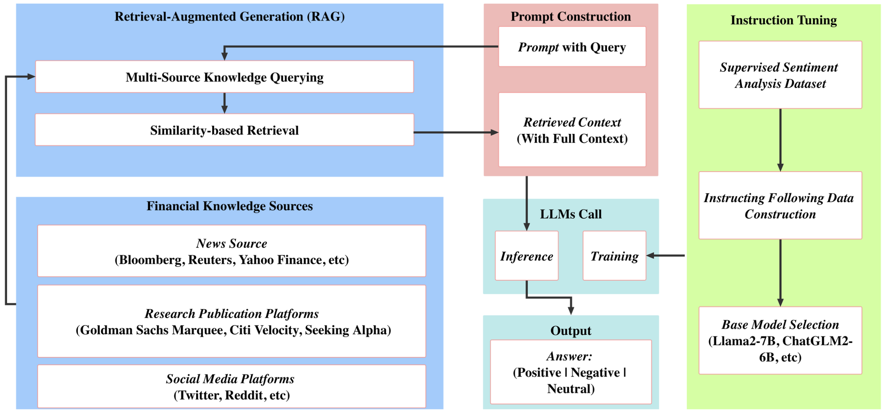
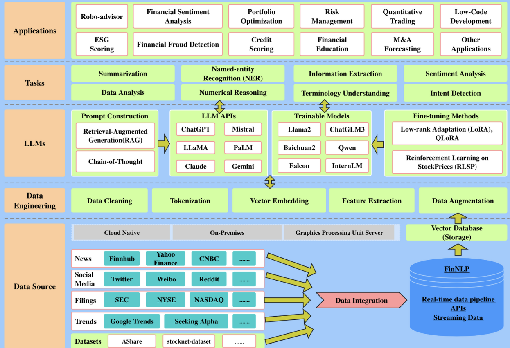
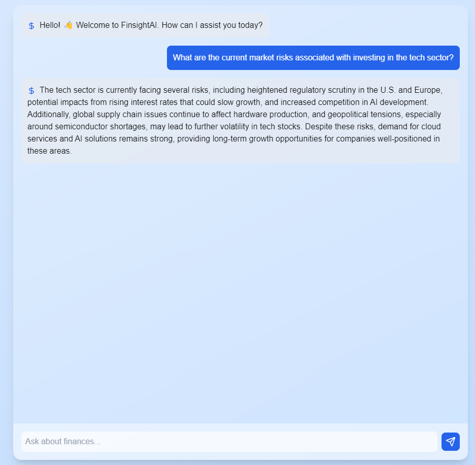

# FinsightAI: Empowering Financial Insight with AI

[](https://www.python.org/downloads/release/python-380/)

<div align="center">

</div>

## Problem Statement: Revolutionizing Information Access and Decision-Making with Large Language Models and Retrieval-Augmented Generation

In today's data-driven world, decision-making is hindered by inefficient access to real-time, accurate information. Traditional systems are limited in their ability to process vast amounts of data contextually. Businesses need more intelligent systems that can analyze real-time data, synthesize domain-specific knowledge, and offer actionable insights. 

Our challenge was to create a cutting-edge solution that leverages Large Language Models (LLMs) and Retrieval-Augmented Generation (RAG) to transform enterprise decision-making. The goal was to provide a dynamic, context-aware system that empowers stakeholders with data-backed insights and innovative strategies.

### How We Overcame This Problem: Our Solution

**FinsightAI** addresses this challenge by integrating a robust AI-powered engine that uses **LLMs** like GPT-4 and **RAG** technology. Our solution offers actionable insights, strategic recommendations, and real-time data analysis in the financial domain.

- **RAG Integration:** We enhanced LLM capabilities by implementing RAG to incorporate domain-specific knowledge, such as real-time market trends and company-specific data. This enables businesses to make more informed decisions with up-to-date insights.
- **Interactive Q&A System:** We built an intuitive, context-aware **Q&A system** that empowers users to ask specific questions about their business and receive dynamic, AI-driven responses tailored to their needs.
- **Data Visualization:** To help users quickly interpret AI-generated insights, we implemented real-time data visualization using **D3.js** and **Plotly**, ensuring that key information is easily accessible and understandable.

## Overview

FinsightAI leverages the power of artificial intelligence to provide in-depth financial insights, analyze market trends, and predict stock movements. It's designed to help financial analysts, investors, and businesses make data-driven decisions with greater accuracy and efficiency.

## Why FinsightAI?

1. **Real-time Adaptation:** The financial world is constantly evolving, and FinsightAI allows for rapid model updates with a lightweight adaptation process, minimizing costs and maximizing accuracy.
   
2. **Accessibility:** Unlike proprietary solutions with limited API access, FinsightAI is fully open-source, allowing for democratization of financial insights using publicly available data.

3. **Reinforcement Learning:** FinsightAI implements RLHF (Reinforcement Learning from Human Feedback), ensuring personalized insights that align with user preferences like risk tolerance and investment style.

## How It Works

FinsightAI integrates financial data from multiple sources, analyzes historical and real-time data, and uses AI models to:

1. Predict stock prices for the next week.
2. Analyze sentiment from financial news and social media.
3. Provide personalized portfolio advice using risk profiles.

<div align="center">

</div>

### Try the Latest Demo

Check out our live demo at [FinsightAI Demo](https://Prisha-Mordia.github.io/FinsightAI/) to test our financial prediction and analysis features.

### Screenshots


## Prerequisites

### For Machine Learning Model (Python)

- **Python 3.10+**
- **Pip**: Install [pip](https://pip.pypa.io/en/stable/installation/) if you haven't already.
- **Virtual Environment** (optional but recommended): To keep dependencies isolated, use `venv` or `conda`.
- **Dependencies**: 
  - `transformers==4.40.1`
  - `peft==0.4.0`
  - `sentencepiece`
  - `accelerate`
  - `torch`
  - `datasets`
  - `bitsandbytes`
  - `flask`
  - `flask_restx`
  - `numpy`
  - `pandas`
  - `scikit-learn`
  - `matplotlib`
  - `seaborn`
  - `requests`

### For Website (Next.js)

- **Node.js**: Make sure you have Node.js installed. [Download here](https://nodejs.org/).
- **npm or yarn**: You will need a package manager like npm (comes with Node.js) or yarn.
- **Next.js**: Install globally with `npm install next -g`.

## Installation

### For Machine Learning Model (Python)

1. Clone the repository:
    ```bash
    git clone https://github.com/Prisha-Mordia/finsightai.git
    cd finsightai
    ```

2. (Optional) Create a virtual environment:
    ```bash
    python3 -m venv venv
    source venv/bin/activate  # On Windows use `venv\Scripts\activate`
    ```

3. Install dependencies:
    ```bash
    pip install -r requirements.txt
    ```

4. Run the model:
    ```bash
    python run_model.py
    ```

### For Website (Next.js)

1. Navigate to the `frontend` directory:
    ```bash
    cd finsightai/frontend
    ```

2. Install dependencies:
    ```bash
    npm install
    ```

3. Run the development server:
    ```bash
    npm run dev
    ```

    The website will be available at `http://localhost:3000`.

4. Build for production (optional):
    ```bash
    npm run build
    ```

## Models and Benchmarks

| Model Name                               | Accuracy  | Performance | Cost   |
| ---------------------------------------- | --------- | ----------- | ------ |
| FinsightAI Predictor V1 (RTX 3090)       | 89.5%     | High        | $10    |
| FinsightAI Sentiment Analysis (A100)     | 85.3%     | Moderate    | $15    |
| LLAMA-3.2                                | 87.8%     | High        | -      |

## Team CodeStorm

- **Team Leader:** Prisha Mordia
- **Members:**
  - Punit Choudhary 
  - Anmol Sharma
  - Sanskar Shrivastava

## License

This project is licensed under the MIT License - see the [LICENSE](LICENSE) file for details.

**Disclaimer:** This project is for educational and research purposes only. Nothing here constitutes financial advice. Always consult a professional before making investment decisions.
